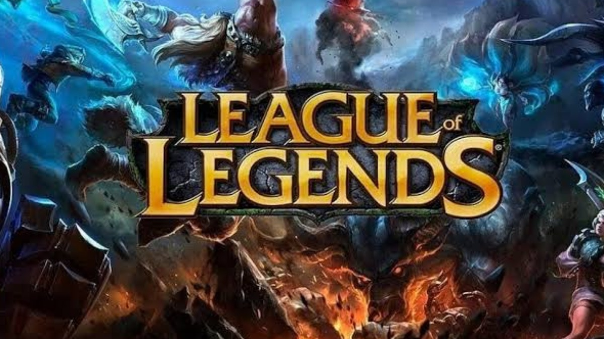
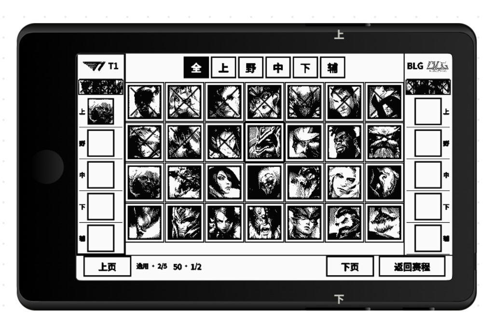
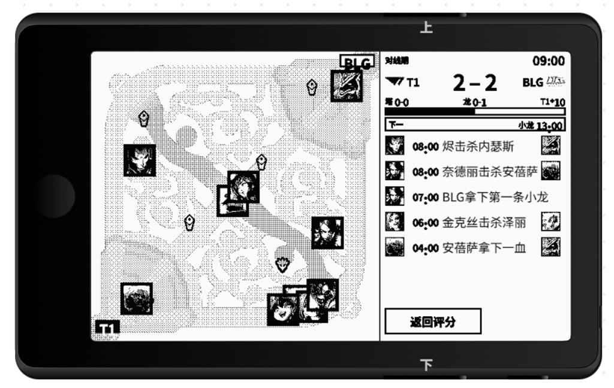

# S16 峡谷

把全球总决赛塞进一块墨水屏。

选一支队伍，走进淘汰赛。征召盘上给对手画叉，再看一血、小龙和击杀从迷你转播里滚过去。这是跑在阅星曈 X4 Pro 上的粉丝观战沙盘。

Stuff the World Championship into an e-ink screen.

Pick a side. Walk the bracket. Cross out their bans. Then watch first blood, dragons, and kills tick past on a pocket broadcast. A fan-made viewing sandbox for the XTEINK X4 Pro.

## 一起来把对战做真 / Build the matches together

这个仓库是来共创的。希望大家一起把游戏做好，让它真的能对战，并且能模拟一届世界总决赛。

现在已经有的是：选队、签表、按分路禁选、抽卡和图鉴。转播能播一血、小龙和击杀，但这一局是从职业时间线里抽一条来演，再按两边阵容偏一下谁赢。它还不是两支队伍真的打出来的一局。

想做成的是：蓝方和红方按征召结果打一局。推线、资源、击杀和胜负都从这局里长出来，再一路打完瑞士轮、八强、半决赛和决赛。阵容不同，系列赛就该不一样。

想法、模拟、英雄池、赛程、界面，Issue 和 Pull Request 都收。

This repo is for building it together. The aim is a game that can actually play a match, then simulate a whole World Championship.

What exists: team select, a bracket, role bans and picks, gacha, and a champion book. The broadcast can show first blood, dragons, and kills, but the match is a pro timeline replay, tilted by the two drafts. It is not yet a game two teams really play.

What we want: blue and red play a match from the draft. Waves, objectives, kills, and the winner come out of that game, then the run continues through Swiss, quarters, semis, and the final. A different lineup should make a different series.

Ideas, the sim, the champion pool, the schedule, the screens: Issues and pull requests are all welcome.

## 先看两眼 / Look first

### 征召，开始耍阴的 / Draft. Time to be mean.

T1 对 BLG。上野中下辅一排滤镜，画了叉的已经进不了场，底下还在数你选了几个。

T1 versus BLG. Filter by role, the crossed-out faces are gone, and the footer is still counting your picks.

### 09:00，峡谷已经打起来了 / 09:00. The Rift is live.

左边是谁站在哪，右边是比分、龙和一条不会停的事件条。烬拿下一血的时候，墨水屏也跟着响一下。

Positions on the left. Score, dragons, and a feed that will not sit still on the right. When Jhin takes first blood, the screen notices.

## 里面有什么 / What's in the box

- 选队和签表已经能走
- 征召盘能按分路禁选，禁用的英雄直接画叉
- 转播能演一局的站位、资源和击杀
- 抽卡、图鉴，打完还有评分

- Team select and the bracket already run
- The draft board bans and picks by role
- The broadcast can play positions, objectives, and kills
- Gacha, a champion book, and a score when it's over

横屏 · Lua API 0.8 · v0.7.3

## 想自己跑 / Run it yourself

把仓库打成 ZIP，在 XTApp Studio 里选「导入项目 ZIP」。进来的是代码和素材，没有聊天记录。

Zip the repo and choose “Import project ZIP” in XTApp Studio. You get the code and the art, not the chat history.

源码在 `project-files/`，入口是 `index.lua`。点阵图在 `assets/xic/`。

Source lives in `project-files/`, entry is `index.lua`. Bitmaps are in `assets/xic/`.

粉丝作品，非官方。英雄、战队、选手和上面这张官方图的权利都归原权利人。仓库公开，就是为了交流、学习和一起改。

Fan work, not official. Champions, teams, players, and the official art above belong to their owners. The repo is public so people can study it, talk about it, and build it together.
